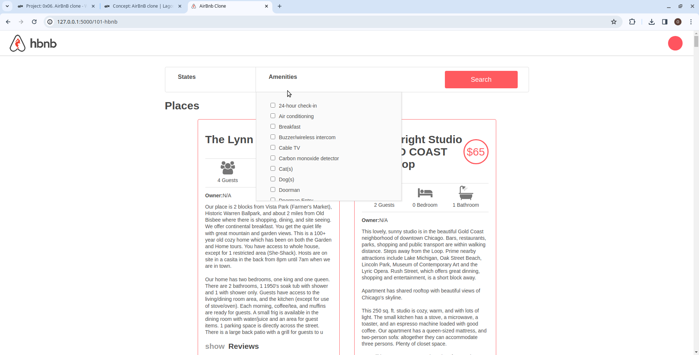

# AirBnB clone - Web dynamic

`Airbnb_clone_v4` is an enhanced version of the original [Airbnb_clone_v3](https://github.com/obimbasmart/AirBnB_clone_v3), now featuring a rich user experience with a dynamic frontend. This version consumes the REST API by loading data from backend, providing user-friendly experience

### Feaures
- `Dynamic Data Loading`: Utilizes jQuery and AJAX to dynamically load data from the backend RESTful API, ensuring an up-to-date collection of places.

- `Filtering Option`s: Users can filter places based on State, city, and amenities, providing a tailored experience for their preferences.

## License
Public Domain. No copy write protection. 
